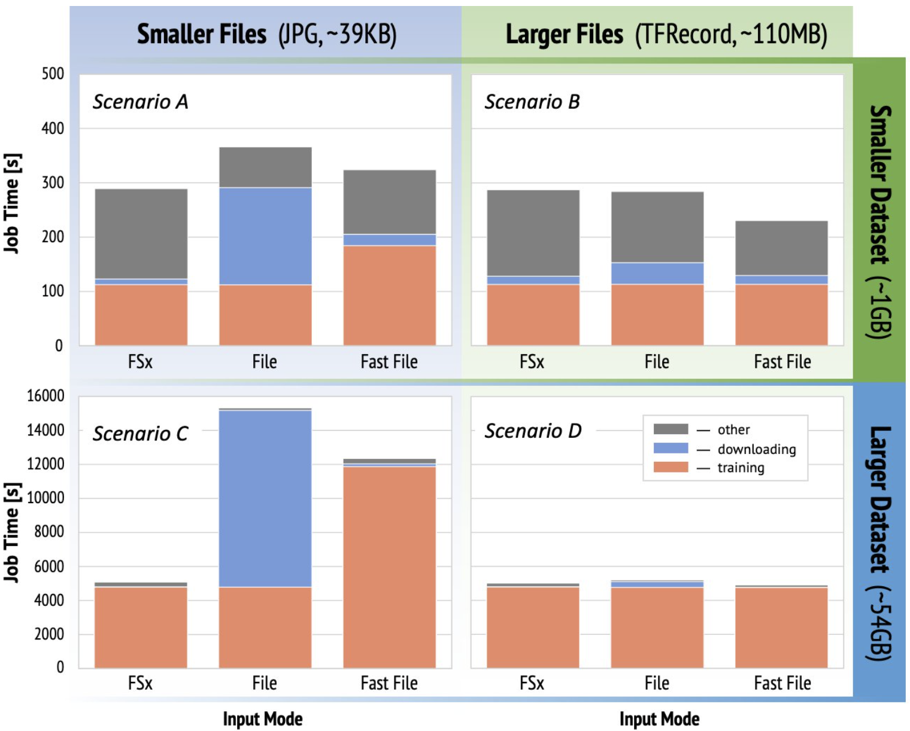

# SageMaker Bencher

**SageMaker Bencher** enables to automatically prepare datasets, as well as design, orchestrate, track, and analyze complex benchmarking experiments based on SageMaker Training Jobs. With SageMaker Bencher you can specify both rules for dataset preparation and benchmarks execution procedure in form of a single YAML-file, allowing ML practitioners to easily share their own benchmark designs, or replicate the benchmarks performed by others with just a single click.

The goal that SageMaker Bencher aims to solve is three-fold:
1. **Large-scale user-friendly experimentation** -- with SageMaker Bencher you can quickly set up an custom benchmark consisting of hundreds of various trials in a human-friendly format by providing a single configuration file in a declarative manner. This configuration file specifies all the necessary settings required to run and track the experiment, including dataset specification and parallel execution strategy for large-scale orchestration of multiple concurrent trials. Each experiment trial can be further set up to execute its own training script, run on different instance types, use various datasets, leverage diverse data ingestion modes, or benchmark any other (hyper-)parameters that one would like to test.
2. **Convenient experiment tracking** -- all trial components of an experiment (including input parameters, code versions, metrics, and output files) are automatically tracked in SageMaker Experiments for subsequent lineage tracking and result analysis.
3. **Easy sharing and one-click reproducibility** -- one of the obstacles when trying to reproduce the published benchmark results is the necessity to first download and then prepare the required dataset in some specific way to ensure "apples to apples" comparison of the results.  With SageMaker Bencher you can automatically download, create, and store datasets on S3 buckets according to various preparation rules before starting benchmarks, thereby enabling others to easily replicate your benchmark results.

## Setup
Before launching an experiment with SageMaker Bencher, there are a few things that we'd need to set up.

### Install all required Python packages
Make sure that you have all the required packages by running

`pip install -r ./requirements.txt`  

### IAM Execution Role
For convience we advice to create a new IAM role named `SageMakerRoleBenchmark` with these two policies attached:
- `AmazonS3FullAccess`
- `AmazonSageMakerFullAccess`

Of course, one can pick any name for the IAM role, just remember to adjust the experiment config file accordingly.

### (optional) Setup FSx for Lustre filesystem
In case you intend to use FSx for Lustre as a data source in your benchmarks, you will need to do the following
 - First create a VPC, subnets, security groups, and S3 endpoint in the region where you plan to run benchamrks with: `./fsx_setup/stack-sm.sh ${REGION} ${S3_BUCKET_NAME}`.
   - Example: `./fsx_setup/stack-sm.sh eu-central-1 sagemaker-benchmark-eu-central-1-<your-AWS-ID>`
 - Then, make sure to write down the output subnet and security group IDs.  
 - Create the FSx filesystem with `./fsx/stack-fsx.sh ${REGION} ${S3_BUCKET_NAME}/ ${FILESYSTEM_CAPACITY} ${SUBNET} ${SECURITY_GROUP}`. 
   - Example: `./fsx_setup/stack-fsx.sh eu-central-1 s3://sagemaker-benchmark-eu-central-1-<your-AWS-ID>/ 3600 subnet-XXXXXXXXXXXXXXXXX sg-XXXXXXXXXXXXXXXXX`.
 - Observe the resulting `FSxFileSystemId` value. Then specify the following fields in the experiment config file:  *subnets*, *security_group_ids*, and *fsx_file_system_id*.    
 - Now you can set `input_mode: fsx` in the trial definition to use the FSx filesystem that we have provisioned above as the corresponding data ingestion mechanism. 

## Run
Launching a benchmarking experiment can either be done programmatically, or by using one of the small launcher scripts:

1. (Option A) run `bencher.py` and specify the experiment config file after the `-f/--file` flag. 

&nbsp;&nbsp;&nbsp;&nbsp;&nbsp;&nbsp;&nbsp;&nbsp;&nbsp; Example: `python bencher.py -f path/to/experiment.yml`

2. (Option B) start benchmarking directly from `bencher.ipynb` notebook (e.g. in SageMaker Studio).

**Note**: make sure that the default region of your AWS CLI is consistent with the region specified in the experiment configuration file.

## An End-to-End Example
As an end-to-end example, let us replicate the benchmarks from the AWS ML blog post ["Choose the best data source for your Amazon SageMaker training job"](https://aws.amazon.com/blogs/machine-learning/choose-the-best-data-source-for-your-amazon-sagemaker-training-job/), where, given various dataset compositions, the authors tested different native SageMaker data ingestion options for image classification use-case with ResNet-50 model (see blog post for details). Concretely, the authors conducted an experiment consisting of 12 trials (and each trial repeated 3 times) to test the following combinations:
- **Input modes** – FSx for Lustre, File mode, FastFile mode
- **Dataset size** – Smaller dataset (1 GB), larger dataset (54 GB)
- **Individual file sizes** – Smaller files (JPGs, approximately 39 KB), Larger files (TFRecord, approximately 110 MB)

For convenience, full specification for all of the benchmarks performed in the blog can be found in form of a SageMaker Bencher experiment configuration file in `experiments/blog-benchmarks-all.yml`. So that the entire experiment consistent of 12 trials can be easily replicated by running:

`python bencher.py -f experiments/blog-benchmarks-all.yml`

---
**NOTE**

See the [Experiment Configuration File Guide](doc/experiment_config.md) for details on structure of experimentation config files.

---

Once started, the results of every conducted trial will be fully logged using SageMaker Experiments, as illustrated below.

When benchmark is finished, the results can be conveniently pulled down to, e.g., a Pandas DataFrame and easily analysed with any tools of your choice. As an example, see [`result_analysis/analyze-and-plot-benchmarks.ipynb`](result_analysis/analyze-and-plot-benchmarks.ipynb) notebook to replicate the benchmark analysis and plots discussed in the mentioned blog post, or produce your own additional plots:

